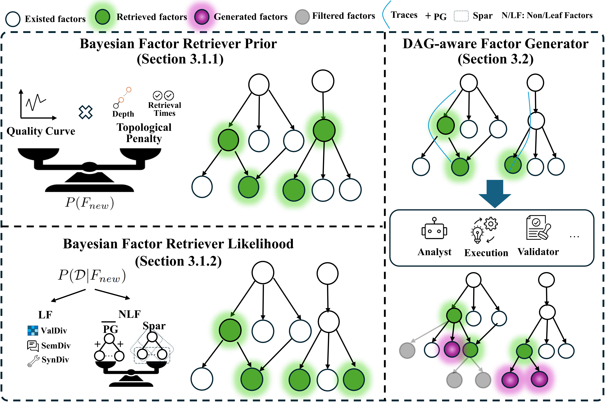

- <div align=center>


  <h1>AlphaPROBE: Alpha Mining Via Principled Retrieval and On-graph Biased Evolution</h1>

  <div>
        <a href="https://scholar.google.com/citations?user=jk4YCOgAAAAJ&hl=zh-CN//" target="_blank">Taian Guo</a><sup>1,2</sup>,
        <a href="https://eachsheep.space/" target="_blank">Haiyang Shen</a><sup>*1</sup>,
        <a href="https://scholar.google.com/citations?user=ZNE_22wAAAAJ&hl=en" target="_blank">Junyu Luo</a><sup>1</sup>,
        <a href="https://scholar.google.com/citations?hl=zh-CN&user=YJMJT0gAAAAJ&view_op=list_works&sortby=pubdate" target="_blank">Binqi Chen</a><sup>1, 2</sup>,
        <a href=""" target="_blank">Hongjun Ding</a><sup>3</sup>,
        <a href="https://scholar.google.com/citations?user=YHbWSOMAAAAJ&hl=zh-CN" target="_blank">Jinsheng Huang</a><sup>1, 2</sup>,
        <a href="" target="_blank">Luchen Liu</a><sup>2</sup>,
        <a href="https://scholar.google.com/citations?user=1hnJ3TgAAAAJ&hl=en" target="_blank">Yun Ma</a><sup>1&#8224</sup>,
        <a href="https://scholar.google.com/citations?user=LbzoQBsAAAAJ&hl=zh-CN" target="_blank">Ming Zhang</a><sup>1&#8224</sup>,


  <div>
    <sup>1</sup>Peking University, <sup>2</sup>Zhengren Quant, <sup>3</sup>Baruch College
         </div>   
  <div>
  <sup>*</sup> Project Leader.
  <sup>+</sup> Corresponding author. 
     </div>


  </div>

  [](https://opensource.org/licenses/MIT)
  [](https://www.python.org/downloads/release/python-3100/)

  </div>

  This repository contains the official implementation of **AlphaPROBE** (**Alpha** Mining Via **P**rincipled **R**etrieval and **O**n-graph **B**iased **E**volution),  a framework that reframes alpha mining as the strategic navigation of a DAG.

  ## 🎯 Overview

  

  AlphaPROBE is a closed-loop alpha mining pipeline consisting of the Bayesian Factor Retriever and the DAG-aware Factor Generator.  The Bayesian Factor Retriever retrieves the most promising factors for evolution, and the DAG-aware Factor Generator is a a structural multi-agent pipeline that generate high-quality and novel offspring from the selected factors.


  ## 👉 Quick Start of AlphaPROBE

  ### Dependency Installation

  ``` shell
  conda create --name your_env  python==3.11.0
  conda activate your_env
  pip install pdm
  pdm install
  ```

  ### Dataset Retrieval

  Run the following command to retrive data from microsoft Qlib

  ``` shell
  wget https://github.com/chenditc/investment_data/releases/latest/download/qlib_bin.tar.gz
  mkdir -p ~/.qlib/qlib_data/cn_data
  tar -zxvf qlib_bin.tar.gz -C ~/.qlib/qlib_data/cn_data --strip-components=1
  rm -f qlib_bin.tar.gz
  ```


  ### RUN AlphaPROBE

  #### Factor Generation

  1. modify dataset name (default csi 300.)
  2. modfiy your model url, model name and model key.
  3. run AlphaPROBE

  ```
  python train_new_work.py
  ```

  #### Factor combination

  ```
  python run_adaptive_combination.py --expression_file your_expression_file
  ```

## **☎️ Contact**


Please feel free to contact the authors below if you have more questions: 

\- Taian Guo, taianguo@stu.pku.edu.cn

\- Haiyang Shen, hyshen@stu.pku.edu.cn

## 🌟 Citation

If you find our work useful, please kindly consider citing our work as follows:
```bibtex
@misc{guo2026alphaprobealphaminingprincipled,
      title={AlphaPROBE: Alpha Mining via Principled Retrieval and On-graph biased evolution}, 
      author={Taian Guo and Haiyang Shen and Junyu Luo and Binqi Chen and Hongjun Ding and Jinsheng Huang and Luchen Liu and Yun Ma and Ming Zhang},
      year={2026},
      eprint={2602.11917},
      archivePrefix={arXiv},
      primaryClass={cs.AI},
      url={https://arxiv.org/abs/2602.11917}, 
}
```